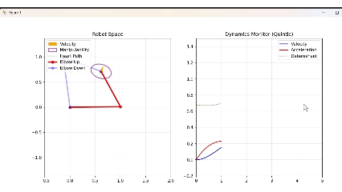

# 2-DOF Robot Arm Simulation (Python)

"Developed a 2-DOF robotic arm simulator with Quintic Polynomial Trajectory Planning, Inverse Kinematics (IK), and real-time visualization of Velocity Vectors & Manipulability Ellipsoids via Jacobian Matrix."

## 🚀 功能特性
* **正/逆运动学求解**：实现了 2-DOF 平面机械臂的几何解析法。
* **轨迹规划**：自定义轨迹（圆、心形）跟随
* **实时动态显示**：利用 Matplotlib 实现机械臂运动过程的交互式可视化。实现了基于五次多项式的轨迹规划，并加入了实时动力学监控面板。系统支持通过雅可比矩阵实时呈现速度矢量及可操作性椭球，直观展示机械臂性能指标。
* **异常处理**：具备工作空间边界检查功能，防止无效解导致程序崩溃。
* **双肘姿态**肘部向上/向下 (Elbow-up/down) 多解切换

## 🛠️ 技术栈
* 语言：Python 3.x
* 库：NumPy (数值计算), Matplotlib (数据可视化)

## 📂 项目结构
* `src/`: 核心算法及主程序
* `docs/`: 存放数学推导笔记及演示动图

## 📝 快速开始
1. 安装依赖：`pip install numpy matplotlib`
2. 运行程序：`python src/main.py`

---
*本项目为个人考研复试准备项目，持续维护中。*
